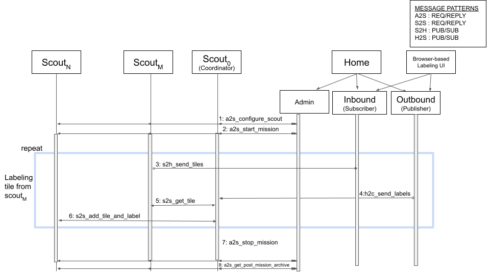

<!--
SPDX-FileCopyrightText: 2022 Carnegie Mellon University <satya-group@lists.andrew.cmu.edu>

SPDX-License-Identifier: GPL-2.0-only
-->

# User Guide

## Hawk Sequence Diagram

Figure 1: Calls made during labeling in Hawk

### Steps:
1. Admin sends configuration message to scouts
2. Mission is started across scouts by admin
3. ScoutM sends selected tile
4. Home sends labels to coordinator
5. Coordinator fetches the tile content from ScoutM
6. If positive, coordinator sends the labeled tile to other scouts
7. Mission may be explicitly stopped by admin
8. Admin collects the logs and models trained on scouts for post processing

## Hawk Components

## Scout

Scouts are distant unmanned compute units collecting and learning on unlabeled
data. The source of unlabeled data may be images stored on the disk or real time
video feed. Each scout receives [configuration message](messages.md#ScoutConfiguration) from home.
The configuration message specifies the type of training, selective and
retraining strategies to be used for the mission. It also contains the weight of initial
DNN model or labeled images needed to train the initial model. The mission is started
upon receiving [start request](a2s_api.md#admin_start_mission) from home.

Once the mission starts, the model in scout processes the input data and a subset of tiles
are chosen by the selective strategy for transmission. These
tiles are transmitted to home using ZeroMQ. After labeling, home sends back
[labels](messages.md#SendLabels) to the coordinator. If a tile is labeled
positive and is not present in the coordinator, indicated by
parentIndex, the coordinator requests the tile content from the parent scout.
The coordinator then sends the [labeled tile](messages.md#LabeledTile) along with its
content to other scouts. Only positives are shared between scouts, if the
tile is negative, then the label is only forwarded to the parent scout.

Scouts train a new model when sufficient positive labels are attained as
specified by the [retrain policy](messages.md#RetrainPolicyConfig). Learning
in scout continues till all input data is exhausted or the mission is explicitly
stopped by home.

## Home

Home is the base station where human annotators are located. When home process starts, it reads the mission
configuration file and launches the necessary labeling interface. It then sends the
configuration to the coordinator to start the mission. The configuration file also specifies the
path to data directories used in the mission and hyperparameters used for training DNN
models. An example configuration file can be found [here](https://github.com/cmusatyalab/hawk/blob/dev/home/configs/config.yml)

Hawk supports three modes of training:
1. Scout-based: Training happens on scouts
2. Cloud-based: Training happens on the cloud and the model is transmitted to scouts
3. Adaptive: The location of training is decided based on bandwidth availability

Home process forks three child processes:
* Admin process: Sends control messages to scouts
* Inbound process: Receives and saves tiles or thumbnails from scouts
* Outbound process: Reads the labels provided by the annotator and send them to the coordinator

Hawk supports two modes of labeling, 1) interactive and 2) scripted. If
interactive labeling is specified, a web-browser is launched for labeling. The
browser displays the thumbnails saved in the inbound path and saves the
labels provided by the user in the outbound path. Otherwise if scripted
labeling is chosen, home programmatically saves the labels of thumbnails
to the outbound path. The label files from this path are then read by the
outbound process to send to the coordinator scout.

## Admin

Admin module sends control messages to scouts. It reads the configuration
file from home and constructs the [configuration
message](messages.md#ScoutConfiguration), which defines the parameters used
during mission. The network is not constricted using FireQos.
Post mission, the admin collects the trained models and logs from scouts.

# Operational Overview

Hawk is a bandwidth-adaptive live learning system, composed of the above
components. The components work together to learn DNN models on the fly and
effectively reduces human effort in collecting positives of a rare new
target. The server process is started on each scout, it waits for the mission
definition and start command from home to begin the mission. Before the
scouts are launched, we assume LAN connectivity between scouts and home.

Home is the location where the human labeler is located. When the home
process is launched it reads the configuration file and starts the necessary
labeling interface. It also launches three child processes necessary for
controlling and communicating with the scouts. Hawk uses ZeroMQ messaging
library for the communication between scouts and home. The messages are
serialized using protocol buffers. Between admin and scouts, we use a
request-reply pattern. In a reply-request pattern, a client connects to a
server, requests info, then receives a reply. The network is not constricted
by FireQos.

Once the scout is launched, the connectivity between scouts and home degrades
and in extreme cases it may be a few kilobits per second. This is emulated by
constricting the network bandwidth using FireQos. At such low bandwidth and high
latency network conditions, we may no receive reply in time.  For this reason we
use a publisher-subscriber message pattern between home and scouts for sending
tiles and labels. The tiles selected are published by the scouts. At home, the
inbound process collects these results and saves them in the "images" directory.
The user specifies a directory for storing mission related data at home. This
directory have three sub-directories, namely: images, meta, and labels. The
"images" directory stores the tiles received by home, the meta-data associated
with the tiles are stored in the "meta" directory. Finally the labels from
annotator are saved in the "labels" directory.

The annotator may choose to label some of the tiles received. The labels
are saved as a json file in the "labels" directory. The outbound process reads
from the "labels" directory and publishes the labels. The coordinator receives
the labels and distributes the labels and the corresponding tile content to
other scouts.

When enough number of tiles have been labeled as specified by the
[retrain-policy](messages.md#RetrainPolicyConfig), a new model is trained.
Training can happen on the scouts or the cloud. If the training happens on the
scouts, then the new model is immediately deployed. However, if the training
happens on the cloud, then the model is first compressed and then transmitted to
the scouts. The incoming data is now processed using the new model. The mission
finishes when the admin explicitly stops the mission or when the scouts stop
capturing input frame.

Figure 1, shows the sequence of calls made during labeling of tiles in Hawk. The
configuration file from home is send to the admin, which constructs the
[configuration message](messages.md#ScoutConfiguration). This message is
transmitted to the scouts via <i>a2s_configure_scout</i> call. When a scout
receives the configuration message, it initializes all modules needed for the
mission which includes training, processing, selective transmission, and so on.
The configuration message also includes the initial bootstrapping examples or the
initial trained model. The admin waits to receive reply from all the
participating scouts. On receiving response from all the participating scouts,
the admin calls <i>a2s_start_mission</i> to begin the mission.  The model
processing the incoming tiles and the selective module selects a small subset
for transmission. These tiles are published by the scouts using
<i>s2h_send_tiles</i> method.  The inbound process receives these tiles along
with their meta-data and saves them in "images" and "meta" directory
respectively. The labels from the annotator are saved in the "labels" directory.
The outbound process reads from this directory and sends the
[labels](messages.md#SendLabel) to the coordinator.  The coordinator calls
<i>s2s_get_tile</i> to fetch the tile content from the parent scout if the label
is a positive.  It then invokes <i>s2s_add_tile_and_label</i> to distribute the
labeled tile along with its content to other scouts. This continues till the end of the mission.
The admin calls <i>a2s_stop_mission</i> to explicitly stop the mission. Post mission, the admin makes
<i>a2s_get_post_mission_archive</i>call to collect the  model generation
 along with logs from the scouts.
